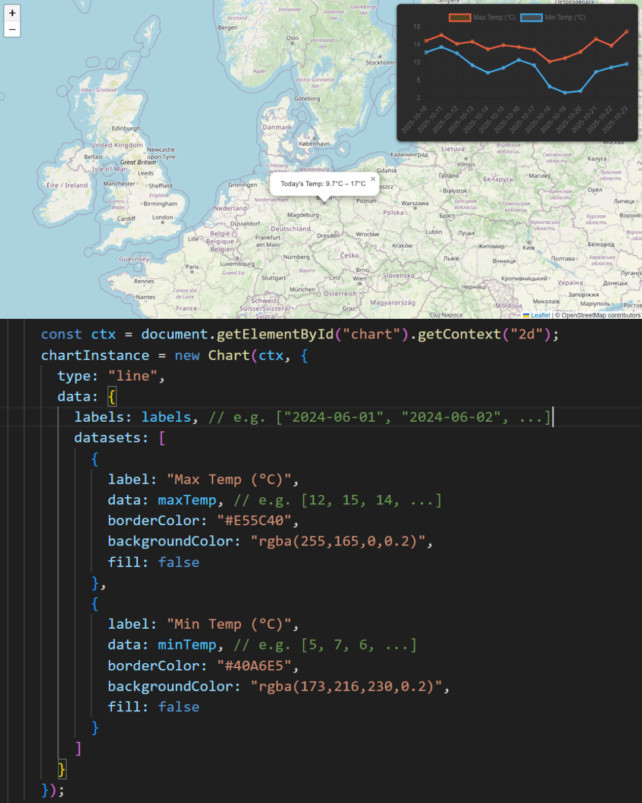
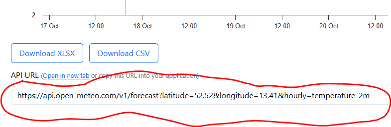

# 🌍 Weather Map (Leaflet + Chart.js)

This is a nice demo app that combines **Leaflet.js** for interactive maps with **Chart.js** for data visualization.  
Click anywhere on the map, and you’ll get the **daily temperature (°C) at 2 meters above ground** for the last 7 days (and optionally the next 7 days) using the [Open-Meteo API](https://open-meteo.com/).



---

## Features
- Interactive map built with **Leaflet**
- Fetches live weather data from **Open-Meteo** (no API key required 🎉)
- Displays temperatures in a **Chart.js line chart**
- Popup on the map shows today’s temperature at clicked location
- Easy to customize → change chart style, add other weather variables (precipitation, wind, etc.)

---

## How the API Works
- Endpoint: `https://api.open-meteo.com/v1/forecast`
- Params:
  - `latitude` and `longitude` → coordinates from map click
  - `daily=temperature_2m_max,temperature_2m_min` → request daily max/min temps
  - `timezone=auto` → auto-detects the local timezone
  - `past_days=7` → include past 7 days
  - `forecast_days=7` → include next 7 days (set `0` if you only want history)
  
Example:
https://api.open-meteo.com/v1/forecast?latitude=52.52&longitude=13.41&daily=temperature_2m_max,temperature_2m_min&timezone=auto&past_days=7&forecast_days=7

##>>>>> YOU CAN FIND ALL POSSIBILITIES HERE ND THE REQUEST/API LINK WHEN YOU SCROLL DOWN AFTER THE FIRST CHART:


The API returns JSON with arrays of dates and values with values respectively:
```json
{
  "daily": {
    "time": ["2025-10-11","2025-10-12", "..."],
    "temperature_2m_max": [15.6, 14.2, ...],
    "temperature_2m_min": [7.1, 6.4, ...]
  }
}
